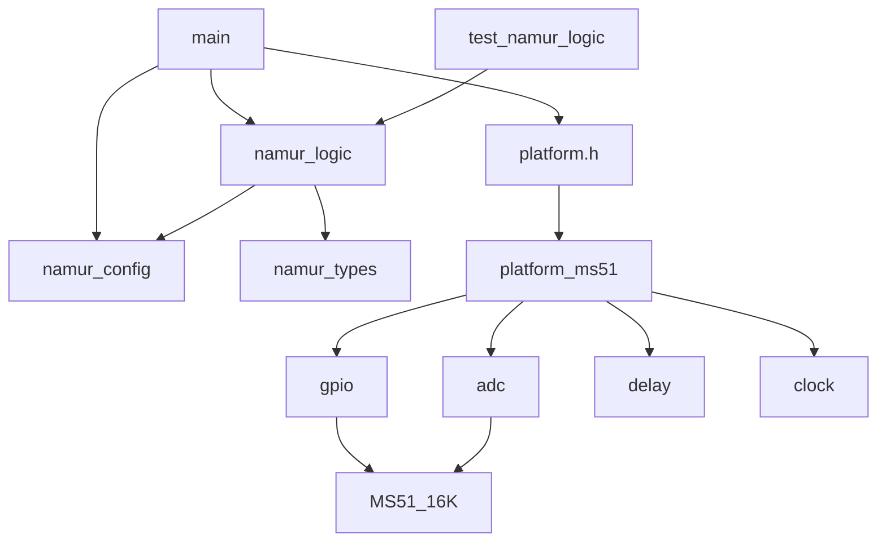

# CURSOR.md

## Repository purpose

MS51-only, 2-channel NAMUR interface firmware (SDCC). Portable threshold/hysteresis logic in `src/app/`; all register access in `src/bsp/ms51/`.

## File responsibilities

| Path | Role |
|------|------|
| `include/namur_config.h` | Thresholds, channel count, ADC constants |
| `include/platform.h` | BSP contract (ADC, DIP, LEDs, delay) |
| `src/app/namur_types.h` | Fault enum, channel/system state structs |
| `src/app/namur_logic.h/c` | µA conversion + per-channel evaluate (no MCU headers) |
| `src/main.c` | Init, 20 ms loop, platform I/O orchestration |
| `src/bsp/ms51/platform_ms51.c` | `platform.h` implementation |
| `src/bsp/ms51/adc.c` | 12-bit ADC, 8-sample average |
| `src/bsp/ms51/gpio.c` | LED outputs, DIP inputs |
| `src/bsp/ms51/delay.c` | Busy-wait ms delay (24 MHz default) |
| `src/bsp/ms51/clock.c` | Reset-default clock (no extended SFR paging) |
| `src/bsp/ms51/ms51_registers.h` | ADC channel IDs |
| `external/nuvoton/ms51/include/MS51_16K.h` | Curated SDCC SFR map |
| `tests/test_namur_logic.c` | Host tests for logic |
| `tests/mocks/mock_platform.c` | Optional `platform.h` mock for integration tests |
| `Makefile` | `make` → firmware; `make test` → host tests |

## Call flow

```
main
  ├─ platform_init()
  │    ├─ ms51_clock_init()
  │    ├─ ms51_gpio_init()
  │    └─ ms51_adc_init()
  ├─ namur_logic_init(&g_state)
  └─ loop every 20 ms
       ├─ platform_read_adc(ch)
       ├─ namur_adc_to_current_ua()
       ├─ platform_read_dip_nc(ch)
       ├─ namur_logic_evaluate_channel()
       ├─ platform_set_channel_led()  [off if fault]
       ├─ platform_set_channel_fault_led()  [per channel, gated by P1.2]
```

## Dependency graph



## Decisions (latest)

- **D002** Curated `MS51_16K.h` — avoids Keil BSP; see `docs/DECISION_LOG.md`.
- **D003** Orchestration in `main.c` — keeps `namur_logic.c` MCU-independent.
- **D005** Documented default pin map — verify on real PCB.

## What changed (this session)

- Bootstrapped full repo structure, docs, Makefile, BSP, app logic, host tests.
- `make` produces `build/firmware.ihx` and `.hex`; `make test` passes.

## Last update

- Date: 2026-05-16
- Summary: Initial MS51-only NAMUR dual-channel SDCC repository complete.
